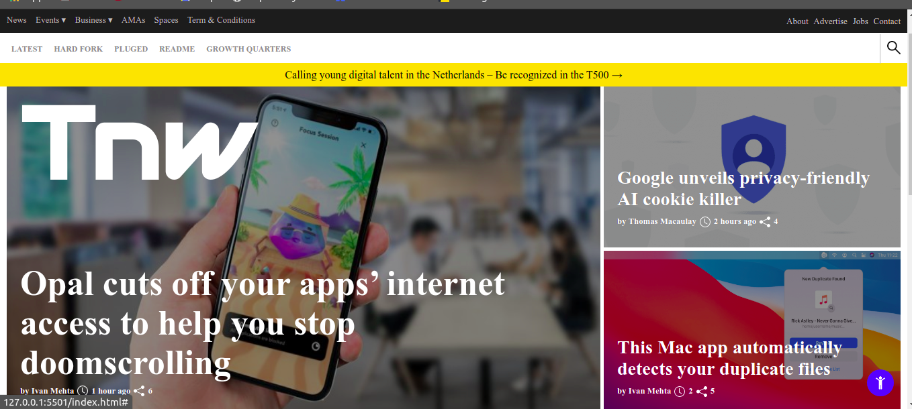

# Project 2: Building with Responsive Web Design - Milestone 1

> Learning how to make web page responsive on different screens

> The project consists of cloning the webpage from the following link:

https://perma.cc/M5ZV-Q2D6

The project includes:

Header
Footer
Highlight
Latest funding
Every single part of the project was done so it's responsive to different size screen devices like cellphones, tablets, and big monitor desktops.

## Built With

- Languages - HTML, CSS
- Frameworks - N/A
- Technology - git and github

## Live Demo

[Live Demo Link](https://francisuloko.github.io/responsive-design-tnw/)

To get a local copy up and running follow these simple example steps.

### Go to github.com/francisuloko/responsive-design-tnw/

### Click Code button

### Open Terminal on your machine

### Enter git clone <repo path>

## Authors

👤 **JAAR**

- GitHub: [@jaarkira](https://https://github.com/jaarkira)
- Twitter: [@91_jaar](https://twitter.com/91_jaar)
- LinkedIn: [LinkedIn](https://https://www.linkedin.com/in/jose-arriaga-63a851204/)

👤 **FRANCIS ULOKO**

- GitHub: [@francisuloko](https://https://github.com/francisuloko)
- Twitter: [@FrancisUloko](https://twitter.com/FrancisUloko)
- LinkedIn: [FrancisUloko](https://linkedin.com/in/FrancisUloko)

## 🤝 Contributing

Contributions, issues, and feature requests are welcome!

Feel free to check the [issues page](issues/).

## Show your support

Give a ⭐️ if you like this project!

## Acknowledgments

- Code Reviewers and StandUp team

## 📝 License

This project is [MIT](lic.url) licensed.
